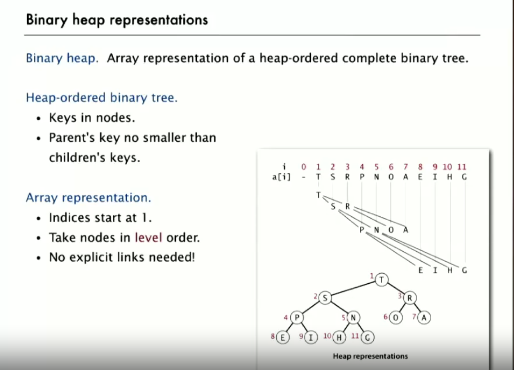
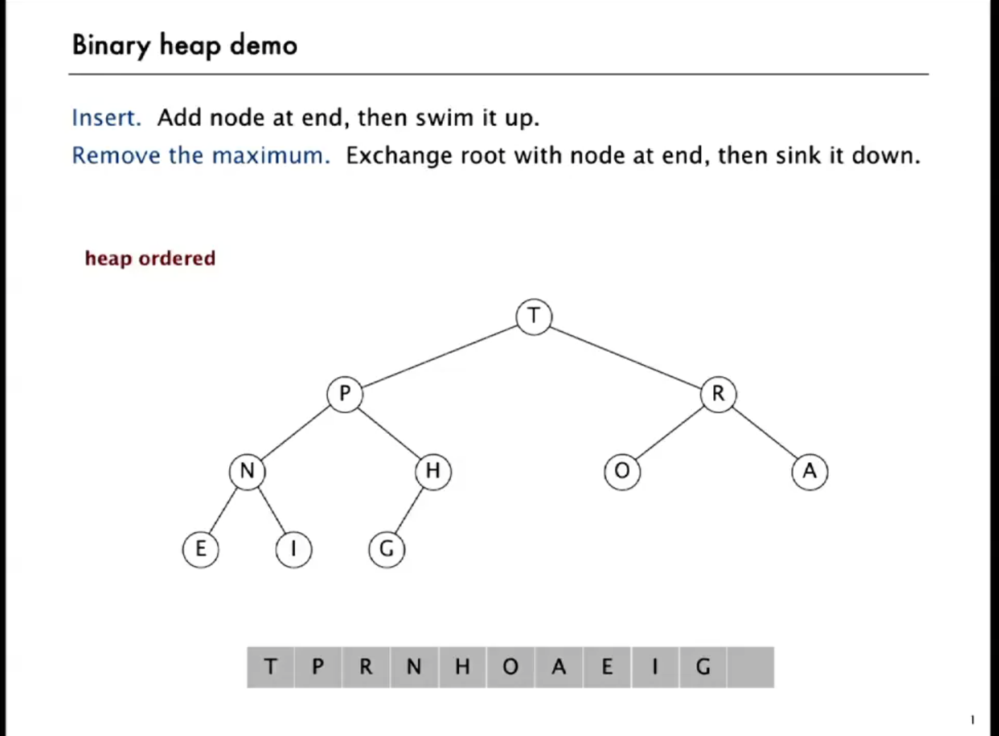

# Binary tree, heap review

- **Balanced binary tree**: height-balanced binary tree, is defined as a binary tree in which the height of the left and right subtree of any node differ by not more than 1.

- **Complete binary tree**: perfectly balanced, except for the bottom level 
  
- **Height** of complete tree of N nodes: lgN

- **Heap**: heaps are the data structure you want to use when you want to be able to access the maximum or minimum element very quickly.

- **Heap property**: the key stored in each node is either greater than or equal to (≥) (*max-heap*) or less than or equal to (≤) (*min-heap*) the keys in the node's children,

- **Binary heap**: array representation of a heap-ordered complete binary tree

    - largest key is a[1], which is the root of the binary tree
    - parent of node at k is k/2
    - children of node k are 2k and 2k+1

